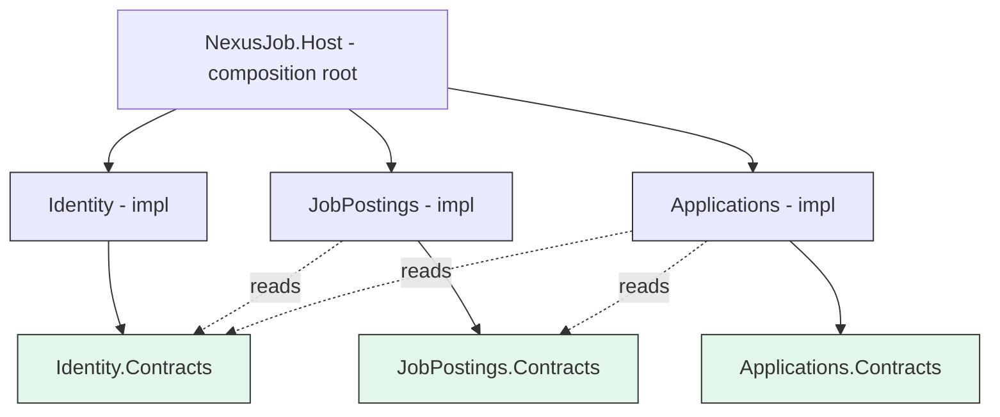
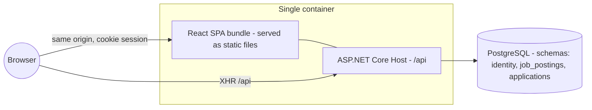
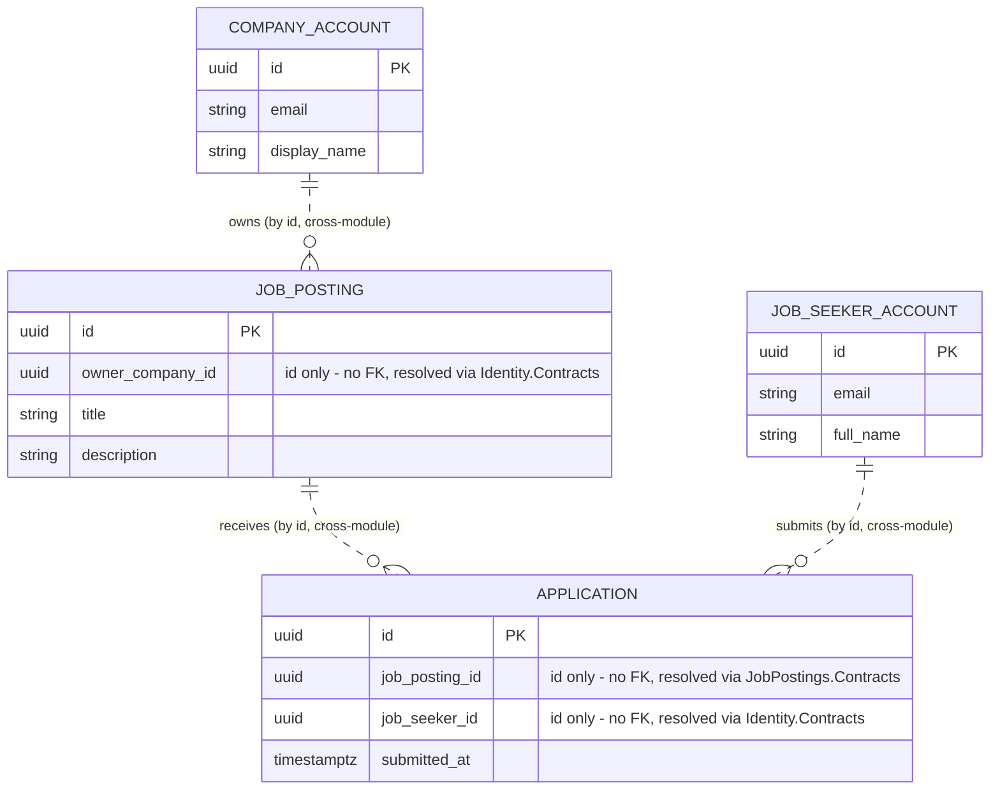
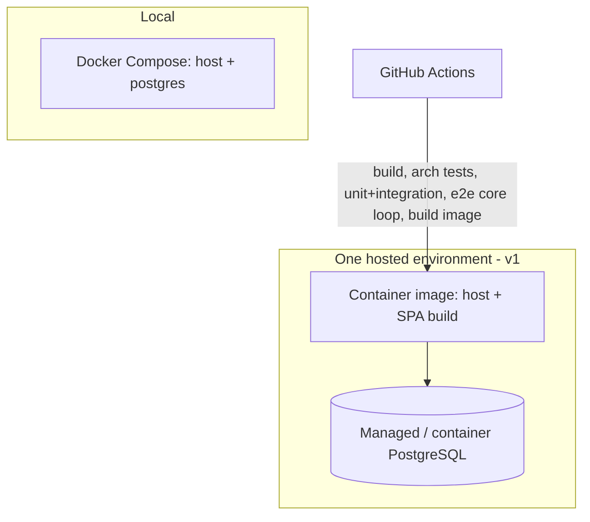

# Architecture Spine — NexusJob

The point of NexusJob is the *build process*, not the job board. This spine therefore spends its
words on the one thing the project is actually practising: **enforced module boundaries in a
modular monolith**. Everything else is kept deliberately CRUD-plain (counter-metric SM-C1).

## Design Paradigm

**Modular monolith.** One deployable process. Three modules, one per DDD bounded context, each
owning its data and exposing a **Contracts-only** public surface. Inside a module: **Vertical
Slice Architecture** — one folder per feature, no horizontal Domain/Application/Infrastructure
layering unless a module earns it (none do in v1). The React frontend applies the same idea with
**Feature-Sliced Design**.

| Paradigm layer | Backend home | Frontend home |
| --- | --- | --- |
| Bounded-context module | `NexusJob.Modules.{Identity,JobPostings,Applications}` | FSD slice group (piloted — see AD-18) |
| Public surface | `NexusJob.Modules.{Context}.Contracts` | generated TS API client (`shared/api`) |
| Feature slice | `Modules/{Context}/Features/<Slice>/` | `features/<slice>/`, `entities/<entity>/` |
| Composition root | `NexusJob.Host` | `app/` |

## Invariants & Rules

Dependency direction — the spine's central rule:



A solid arrow is a project reference; a dotted arrow is a runtime call through a Contract
interface. Any edge not shown here is a boundary violation and must fail CI (AD-2).

### AD-1 — Module = bounded context, Contracts-only public surface `[ADOPTED]`

- **Binds:** all backend code
- **Prevents:** two modules independently modelling the same concept; one module reaching into
  another's internals so the boundary erodes into a big ball of mud
- **Rule:** each module is split by **bounded context, never by data entity**. Its only public
  surface is its `*.Contracts` project (interfaces + DTOs). A module implementation project may
  reference other modules' `*.Contracts` and nothing else of theirs. `*.Contracts` projects
  reference no implementation project.

### AD-2 — Boundary violations break the build `[ADOPTED]`

- **Binds:** CI pipeline; NFR-module-boundary; SM-2
- **Prevents:** boundary rules decaying to "developer discipline" and silently rotting
- **Rule:** ArchUnitNET tests run in CI and **fail the build** when (1) a module impl assembly
  depends on another module's non-Contracts assembly, (2) a `*.Contracts` assembly depends on any
  impl assembly, (3) any project other than `NexusJob.Host` depends on a module impl assembly,
  (4) a `FromSqlRaw` / `ExecuteSql*` call carries a schema-qualified name outside the caller's own
  schema (best-effort backstop for AD-5). The frontend equivalent — an ESLint boundary rule
  (`eslint-plugin-boundaries`) encoding the FSD layer order — is likewise build-breaking. These
  tests are a primary deliverable, not optional quality gates.

### AD-3 — Vertical slices; no speculative layering `[ADOPTED]`

- **Binds:** all module internals; counter-metric SM-C1
- **Prevents:** two modules adopting incompatible internal structures; Clean-Architecture
  ceremony (mediator + generic repository + unit-of-work + mapper) piled onto CRUD
- **Rule:** inside a module, organise by feature: `Features/{Slice}/` holds that slice's
  endpoint, handler, request/response, and validation. No separate Domain/Application/
  Infrastructure projects in v1. Introduce full layering in a *single* module only when its
  domain logic demonstrably justifies it, recorded as a new AD.

### AD-4 — The three modules and what each owns

- **Binds:** FR-1…FR-7; the domain data model
- **Prevents:** ambiguous ownership — two modules writing "the posting", or neither owning the
  one-application-per-pair rule
- **Rule:** exactly three modules, each the sole owner of its data:
  - **Identity** — `CompanyAccount` (id, email, password_hash, **display_name**),
    `JobSeekerAccount` (id, email, password_hash, **full_name**); registration, sign-in, cookie
    session issue. All `/api/auth/*` routes are Identity's.
  - **JobPostings** — `JobPosting` (id, `owner_company_id`, title, description, created_at);
    creation and keyword search.
  - **Applications** — `Application` (id, `job_posting_id`, `job_seeker_id`, submitted_at); the
    `UNIQUE (job_posting_id, job_seeker_id)` constraint lives here and nowhere else.
  No other module may hold a writable copy of another module's entity. The *Contract* shape each
  module exposes to the others is fixed by AD-19, not by this column list.

### AD-5 — A module writes only its own schema; reads others only through their Contract

- **Binds:** all data access
- **Prevents:** hidden coupling via shared tables; a write path that bypasses the owning module's
  rules
- **Rule:** a module's `DbContext` maps only its own entities, and its connection's
  `search_path` is set to its own schema. To obtain another module's data at runtime, call that
  module's Contract interface. Direct SQL or EF access across a schema boundary is forbidden.
  Enforcement is layered, not absolute: the assembly-dependency tests (AD-2 rules 1–3) stop a
  module *referencing* another's code; the `DbContext` mapping + `search_path` make a
  cross-schema query the deviant path; AD-2 rule 4 flags schema-qualified raw SQL. A determined
  raw-ADO call is still caught only by review — accepted, given the stakes.

### AD-6 — Inter-module communication is synchronous, in-process, through Contracts

- **Binds:** all cross-module interaction
- **Prevents:** one module coding to an event/queue while another expects a direct call;
  standing up messaging infrastructure the v1 domain has no workflow for
- **Rule:** cross-module calls are synchronous method calls on a Contract interface resolved from
  DI. No domain-event bus, no message broker, no `IntegrationEvent` publishing in v1. A future
  cross-module workflow that needs decoupling is added as a new AD, not improvised.

### AD-7 — One database, schema-per-module, no cross-schema foreign keys

- **Binds:** persistence; migrations
- **Prevents:** the database re-coupling modules the code keeps apart; a migration in one module
  breaking another
- **Rule:** one PostgreSQL database. Schemas `identity`, `job_postings`, `applications`. **No
  foreign key crosses a schema.** Cross-module references are stored as a bare id
  (`ownerCompanyId`, `jobPostingId`, `jobSeekerId`); their validity is checked in application
  code via the owning module's Contract, not by the database. Each module owns its own EF
  migration history.

### AD-8 — One write request mutates exactly one module

- **Binds:** all command handlers; FR-1…FR-3, FR-6
- **Prevents:** a builder introducing a distributed transaction, a two-phase write, or a
  "combined" endpoint that writes to two schemas
- **Rule:** an *action* here means **one HTTP request handled by one module's slice**. Each v1
  write request is satisfied within a single module's schema and a single EF `SaveChanges`
  (register → Identity, create posting → JobPostings, apply → Applications). No request handler
  writes another module's schema; no endpoint combines two modules' writes. A user *gesture* that
  needs two modules (the apply-gate — see AD-21) is two requests the frontend chains, not one
  endpoint. A future server-side multi-module workflow is modelled as an eventually consistent
  sequence (deferred), never a cross-module DB transaction.

### AD-9 — The posting-ownership check for FR-7 lives in Applications

- **Binds:** FR-7
- **Prevents:** JobPostings and Applications each implementing "does this company own this
  posting" differently, or both assuming the other does it; a status code that leaks a posting's
  existence
- **Rule:** `GET /api/applications?jobPostingId=<id>` (Applications module, Company session) is
  the FR-7 endpoint. Its handler calls `IJobPostingsApi.GetPostingOwner(id)` and compares the
  result to the caller's account id from the session (AD-13). Response contract:
  - posting missing **or** not owned by the caller → **`404`** with ProblemDetails — byte-for-byte
    identical for both cases; never `403` (that would confirm the posting exists).
  - owned, zero applicants → **`200`** with an empty `Page<ApplicantDto>` (so EXPERIENCE.md's
    "No applicants yet." is reachable).
  The frontend renders its "no longer available" not-found treatment for the `404` in **both**
  cases — there is no distinct "forbidden" screen. JobPostings exposes the ownership fact; it
  never performs the authorization.

### AD-10 — The host is the only composition root

- **Binds:** project structure; DI wiring
- **Prevents:** an implicit web where any module can construct or configure any other
- **Rule:** `NexusJob.Host` is the sole project that references module *implementation* projects.
  Each module exposes `AddXxxModule(IServiceCollection, IConfiguration)` and
  `MapXxxModule(IEndpointRouteBuilder)`; the host calls them and does nothing else module-specific.

### AD-11 — Per-role email uniqueness; two account tables `(resolves PRD OQ-4)`

- **Binds:** FR-1, FR-2; Identity's data model
- **Prevents:** FR-1/FR-2 being read two ways — one identity table with a global unique email
  vs. two independent account spaces
- **Rule:** `CompanyAccount` and `JobSeekerAccount` are separate tables; email is unique
  *within each table*, not across both. The same email address may hold one Company account and
  one Job Seeker account as two unrelated identities. Sign-in resolves to `(accountType,
  accountId)` and both values go onto the cookie (AD-13). `[This spine resolves PRD OQ-4; the PRD
  should be updated to match.]`

### AD-12 — Same-origin deployment; no separate BFF proxy

- **Binds:** deployment topology; frontend↔backend integration; auth
- **Prevents:** one part of the build assuming a cross-origin SPA + gateway, another assuming
  co-hosting; pulling in a commercial BFF/gateway product
- **Rule:** `NexusJob.Host` serves the built React bundle as static files **and** the `/api`
  routes from one origin. No YARP, no Duende BFF, no standalone gateway in v1. Cross-origin
  concerns (CORS preflight, third-party cookie handling) are therefore out of scope by
  construction.

### AD-13 — Cookie auth, framework-light, CSRF-protected

- **Binds:** FR-1, FR-2, FR-6, FR-7; NFR-credential-security
- **Prevents:** each module inventing its own auth check; passwords stored or logged unsafely;
  a login CSRF hole
- **Rule:** ASP.NET Core **cookie authentication** issues one `HttpOnly; Secure; SameSite=Lax`
  cookie. Claims: `ClaimTypes.NameIdentifier` = the account id (`Guid` as string) and a
  `account_type` claim = `company` | `job_seeker`. "Who is calling" is **always** read from
  `NameIdentifier` — never an email claim, never a Contract lookup by email. Only Identity's
  `/api/auth/*` slice issues, renews, or clears this cookie.
- Passwords are hashed with `Microsoft.AspNetCore.Identity.PasswordHasher<T>` (PBKDF2-HMAC-SHA256)
  with `IterationCount` set explicitly to the current OWASP figure (≥ 600 000) — not the library
  default; Argon2id is the named upgrade path. The full ASP.NET Core Identity framework is **not**
  used; Identity owns its own account tables and register/sign-in logic. Password material and
  cookie values are never written to logs.
- State-changing requests (anything but `GET`/`HEAD`) require an antiforgery token: ASP.NET Core
  antiforgery, double-submit, header `X-CSRF-TOKEN`, seeded by a `GET /api/auth/csrf` the SPA
  calls on load.
- Data Protection keys are persisted to a `data_protection_keys` table owned by `NexusJob.Host`
  (AD-22) so cookies survive restarts and multiple instances agree.
- Authorization = `account_type` claim + resource-ownership checks owned by the relevant module
  (AD-9).

### AD-14 — No mediator library; endpoints call slice handlers directly

- **Binds:** all module internals
- **Prevents:** a licensing/cost dependency (MediatR is commercial since 2025); "pipeline
  behavior" sprawl
- **Rule:** slices are plain handler classes resolved from DI and invoked directly by Minimal
  API endpoint delegates. Cross-cutting concerns are ASP.NET Core middleware or endpoint filters
  (auth, antiforgery, request validation, `exception → ProblemDetails`, structured logging).
  Adopt a source-generated mediator only if pipeline pressure becomes real — as a new AD.

### AD-15 — HTTP contract shape is uniform and generated

- **Binds:** every endpoint; frontend↔backend integration
- **Prevents:** modules returning inconsistent error/success shapes; the frontend hand-copying
  DTOs that then drift
- **Rule:** errors are RFC 9457 **ProblemDetails**. Success responses return the resource
  representation directly — no custom envelope.
- Every paginated list (search results FR-4, applicants FR-7, "my applications") uses this exact
  shape, no variations: `Page<T> { items: T[]; page: int; pageSize: int; total: int }` —
  **offset** pagination, `page` is **1-based**, request params `?page=&pageSize=`, `pageSize`
  default 20 / max 100. No cursor pagination in v1.
- The host emits **one OpenAPI 3.0 document** (`.NET 10`'s generator is pinned to 3.0 output —
  NSwag's TS client generator is not reliable on 3.1). The frontend's TypeScript client is
  **generated from that document in CI** (NSwag) and is the only permitted description of the API
  on the client side. Hand-written request/response types that duplicate the API are forbidden.
  `[If the 3.0 pin proves lossy, the fallback is Orval — 3.1-native, emits TanStack Query hooks;
  logged as an open option.]`

### AD-16 — Frontend FSD layering, downward imports only, CI-enforced

- **Binds:** all frontend code
- **Prevents:** two features importing each other sideways; the frontend losing the boundary
  discipline the backend enforces
- **Rule:** layers `app → pages → widgets → features → entities → shared`. A module in a layer
  may import only from layers **below** it. `eslint-plugin-boundaries` encodes this and fails the
  build (AD-2). Server state is TanStack Query; **query keys are owned by the `entities/<noun>`
  slice** for that resource and imported by features — features do not invent their own keys.
  The generated client (`shared/api`) is imported only from an `entities/*/api` or `features/*/api`
  segment, never from `ui` or `model`. There is no global client-state store in v1.

### AD-17 — "FSD slice mirrors bounded context" is a pilot, not a rule

- **Binds:** frontend slice organisation
- **Prevents:** committing the whole frontend to an unproven backend↔frontend mapping (research
  found zero production precedent)
- **Rule:** the mapping is applied **only** to the Applications capability, end to end, first.
  A checkpoint after that slice ships decides whether to propagate it to JobPostings/Identity or
  organise those purely by frontend concern. Until then, other slices are organised by frontend
  need. `Revisit: after the first vertical slice ships.`

### AD-18 — Anonymous browse; auth only to apply `(resolves PRD OQ-3)`

- **Binds:** FR-4, FR-5, FR-6
- **Prevents:** search/detail endpoints and their frontend routes disagreeing on whether a
  session is required
- **Rule:** search (FR-4) and posting detail (FR-5) endpoints are `AllowAnonymous`. Only apply
  (FR-6), create-posting (FR-3), and view-applicants (FR-7) require an authenticated session.
  Keyword search is a case-insensitive substring match executed in the database (EF
  `Contains` / `ILIKE`) inside JobPostings — no search engine, no index service.

### AD-19 — Each module's Contract surface is an explicit, fixed DTO set

- **Binds:** every cross-module call; the generated frontend client
- **Prevents:** two consumers assuming different field names, optionality, id types, or a
  polymorphic "account" DTO; an N+1 of per-row Contract calls in a list projection
- **Rule:** Contracts expose named DTOs only (never entities), `Guid` ids in C# signatures
  (string only at the HTTP/JSON edge), all fields non-null unless the name says otherwise:
  - `IIdentityApi`: `GetCompany(Guid) → CompanySummaryDto { Guid Id; string DisplayName }`;
    `GetJobSeeker(Guid) → JobSeekerSummaryDto { Guid Id; string FullName; string Email }`;
    plus **batch** `GetCompanies(IReadOnlyCollection<Guid>)` / `GetJobSeekers(…)` returning a
    `IReadOnlyDictionary<Guid, …Dto>`. Email is exposed **only** on `JobSeekerSummaryDto`, and
    only because FR-7's applicant list needs it.
  - `IJobPostingsApi`: `GetPostingOwner(Guid postingId) → Guid? OwnerCompanyId` (null = no such
    posting); `GetPostingSummaries(IReadOnlyCollection<Guid>) → …Dictionary` for list rows.
  - There is **no `IApplicationsApi`** — nothing else needs Applications' data. The backend
    Contract graph is exactly `Applications → {Identity, JobPostings}` and `JobPostings →
    Identity` (the dependency diagram above). Any count/aggregate a Company view wants comes from
    an Applications *HTTP endpoint* the frontend calls, never a new backend edge.
  - List/table projections **must** use the batch getters — a per-row Contract call is a defect.

### AD-20 — Apply is idempotent; the "already applied" state has one read path

- **Binds:** FR-6; the EXPERIENCE.md apply-button states
- **Prevents:** a duplicate-apply race returning `500`; JobPostings taking a dependency on
  Applications (or a cross-schema query) to render the Apply button
- **Rule:** the Apply handler **inserts and catches**: attempt the insert; on the unique-violation
  (Postgres `23505`) return **`200`** with the existing `ApplicationDto` — never `409`, never
  `500`. No pre-check SELECT is used as the guard (it loses the race); the DB constraint (AD-4) is
  the guard. The on-load Apply-button state comes from **`GET /api/applications/mine?jobPostingId=<id>`**
  (Applications module, requires a Job Seeker session): `200 { applied, appliedAt }` or `200
  { applied:false }`. The frontend calls this directly; **JobPostings never calls Applications**
  for it.

### AD-21 — The apply-gate is a frontend-orchestrated two-request sequence

- **Binds:** FR-6; EXPERIENCE.md Flow 2 (signed-out apply)
- **Prevents:** a "register-and-apply" combined endpoint (violates AD-8); disagreement on what
  happens when the second call fails
- **Rule:** signed-out apply is **two** requests the SPA issues in order: (1)
  `POST /api/auth/register` (Identity — creates the Job Seeker account **and** signs the cookie in
  one response), then on success (2) `POST /api/applications` with body `{ jobPostingId }`
  (Applications). No server-side orchestration, no saga, no shared transaction. Partial failure —
  (1) succeeds, (2) fails — **leaves the account created and signed in** (matches EXPERIENCE.md's
  failure path); the SPA shows the retry affordance and re-issues only request (2). An
  already-signed-in Job Seeker skips step (1).

### AD-22 — Operability floor

- **Binds:** the host; deployment; NFR-credential-security; SM-1
- **Prevents:** "deployed and usable" (SM-1) resting on undefined health/'config/secret handling;
  a Data-Protection-keys table with no owner
- **Rule:** `NexusJob.Host` exposes `GET /health` (process liveness + a `SELECT 1` DB probe).
  Logging is structured JSON to stdout with credential/hash/cookie redaction (also a convention
  below). All config and secrets (DB connection string, Data Protection key ring config,
  `PasswordHasher` iteration count) come from environment / .NET configuration — nothing secret in
  the image or repo. The `data_protection_keys` table lives in the `public` schema and is owned by
  the Host, not any module (it is infrastructure, not domain data). Distributed tracing /
  OpenTelemetry is deferred (see Deferred).

## Consistency Conventions

| Concern | Convention |
| --- | --- |
| Backend projects | `NexusJob.Host`, `NexusJob.Modules.<Context>`, `NexusJob.Modules.<Context>.Contracts`, `NexusJob.ArchitectureTests` |
| Slice folders | `Modules/<Context>/Features/<VerbNoun>/` (e.g. `Features/CreatePosting/`) |
| Identifiers | `Guid` v7 via `Guid.CreateVersion7()`, generated in application code; `Guid` in C# and Contract signatures, **string only** in JSON |
| Timestamps | UTC only, ISO-8601 in the API, `timestamptz` in Postgres; column/field `*_at` / `*At` |
| REST paths | lowercase plural nouns; prefix follows the **owning module** — `/api/job-postings/*` (JobPostings), `/api/applications/*` (Applications, incl. FR-7 & apply-button state), `/api/auth/*` (Identity) |
| Error shape | RFC 9457 ProblemDetails on every non-2xx |
| Pagination | `?page=` (1-based) `&pageSize=` (default 20, max 100); response `Page<T>` per AD-15 |
| DB identifiers | `snake_case`; one schema per module (`identity`, `job_postings`, `applications`); `data_protection_keys` in `public` |
| Cross-module refs | stored as a bare id column; resolved via a Contract **batch** getter (AD-19), never a FK, never per-row |
| Contract surface | `I<Context>Api` in `*.Contracts`; explicit `*Dto` types (no entities, no polymorphic account DTO); future events past-tense (`ApplicationSubmitted`) |
| C# / TS style | C# PascalCase members; TS client types are generated — do not edit by hand |
| Auth claims | `NameIdentifier` = account id (Guid); `account_type` = `company`\|`job_seeker`; identity read only from `NameIdentifier` |
| Logging | structured JSON to stdout; never log credentials, password hashes, or cookie values |
| Config | environment / .NET configuration; no secret in image or repo |
| Frontend slices | `features/<verb-noun>/`, `entities/<noun>/`, each with `ui/ api/ model/` segments; query keys owned by `entities/<noun>` |

## Stack

Seed — currency checked 2026-09-05; at cold-start take the latest patch of each line, then the
code owns these.

| Name | Version |
| --- | --- |
| .NET / C# | 10 (LTS) / 14 |
| ASP.NET Core (Minimal APIs) | 10 — OpenAPI generator pinned to **3.0** output (AD-15) |
| Entity Framework Core + Npgsql provider | 10 |
| PostgreSQL | 18 |
| ArchUnitNET (CI boundary tests) | ~0.13.x (actively maintained; NetArchTest rejected — stale since 2023) |
| Input validation | built-in .NET 10 minimal-API validation (`AddValidation()`, DataAnnotations-based); FluentValidation deferred until rule complexity justifies it |
| Testcontainers for .NET (integration tests) | ~4.x |
| React | 19.2.x |
| TypeScript | 6.x (whatever the current Vite React-TS template ships) |
| Vite | 8.x |
| TanStack Query | v5 |
| React Router | v8 |
| OpenAPI → TS client generator | NSwag — pin the exact version; fallback option Orval (see AD-15) |
| FSD lint | `eslint-plugin-boundaries` (true ESLint rule); Steiger optional as an extra FSD check |
| Container runtime | Docker; Docker Compose for local |
| CI | GitHub Actions |

## Structural Seed

### Container / system view



### Core entities (names + cross-boundary references only)



`..` relationships are cross-module and therefore **not** enforced by a database FK (AD-7). The
only real DB constraint spanning two of these ids is `APPLICATION` unique `(job_posting_id,
job_seeker_id)` (AD-4).

### Deployment / environments



Migrations run per-module as a release step before the new image serves traffic. No staging/prod
split in v1 `[ASSUMPTION]`. Hosting platform undecided — candidates: single Docker host, Azure
Container Apps, Fly.io, Render.

### Operations (v1 floor — AD-22)

| Concern | v1 |
| --- | --- |
| Health | `GET /health` — liveness + `SELECT 1` |
| Logs | structured JSON to stdout; creds/hashes/cookies redacted |
| Metrics / tracing | none in v1; OpenTelemetry deferred |
| Secrets & config | environment / .NET configuration only (DB DSN, key-ring, hash iteration count) |
| Data Protection keys | `public.data_protection_keys`, owned by the Host |
| Backups, alerting, SLOs | out of v1 scope (learning project; SM-1 = "deployed and usable") |

### Source tree

```text
nexusjob/
  backend/
    NexusJob.Host/                     # composition root; serves SPA + /api; only referencer of module impls
    NexusJob.Modules.Identity/
      Features/{Register,SignIn,SignOut,Csrf,Me}/   # all /api/auth/*
      Persistence/                     # DbContext: entities mapped, search_path = "identity"
    NexusJob.Modules.Identity.Contracts/            # IIdentityApi + *SummaryDto (AD-19)
    NexusJob.Modules.JobPostings/
      Features/{CreatePosting,SearchPostings,GetPosting}/
    NexusJob.Modules.JobPostings.Contracts/         # IJobPostingsApi
    NexusJob.Modules.Applications/
      Features/{Apply,GetMyApplicationForPosting,ListApplicants,ListMyApplications}/
    NexusJob.Modules.Applications.Contracts/        # IApplicationsApi
    NexusJob.ArchitectureTests/        # ArchUnitNET; runs in CI, build-breaking
  frontend/
    src/
      app/  pages/  widgets/  features/  entities/  shared/
      shared/api/                      # generated TS client (do not hand-edit)
  docker-compose.yml
  .github/workflows/ci.yml
```

## Capability → Architecture Map

| FR / concern | Lives in | Governed by |
| --- | --- | --- |
| FR-1/FR-2 sign up / log in | Identity · `Features/{Register,SignIn}` + `features/auth` | AD-4, AD-11, AD-13 |
| FR-3 create job posting | JobPostings · `Features/CreatePosting` | AD-4, AD-8, AD-13, AD-15 |
| FR-4 keyword search | JobPostings · `Features/SearchPostings` | AD-15, AD-18 |
| FR-5 posting detail (+ company name) | JobPostings (batch-reads `IIdentityApi`) | AD-6, AD-18, AD-19 |
| FR-6 apply to a posting | Applications · `Features/Apply` (+ apply-gate) | AD-4, AD-8, AD-13, AD-17, AD-20, AD-21 |
| FR-6 apply-button state (already applied) | Applications · `Features/GetMyApplicationForPosting` | AD-20 |
| FR-7 view applicants | Applications (batch-reads `IIdentityApi`; ownership via `IJobPostingsApi`) | AD-6, AD-9, AD-13, AD-15, AD-19 |
| NFR module boundary (SM-2) | `NexusJob.ArchitectureTests` + `eslint-plugin-boundaries` | AD-1, AD-2 |
| NFR credential security | Identity | AD-13, AD-22 |
| NFR single web app | `NexusJob.Host` | AD-12, AD-22 |

## Deferred

- **Domain events / async messaging** — no v1 cross-module workflow needs it; notifications are
  out of PRD scope. Revisit when a write must fan out across modules.
- **Full layered Clean Architecture for a module** — none of the three earns it at v1
  complexity (SM-C1). Revisit per-module if domain logic deepens.
- **Posting lifecycle (edit / deactivate / delete)** — PRD OQ-1, out of scope; JobPostings
  already solely owns posting mutation, so adding it later is contained.
- **Source-generated mediator / Mapperly** — only if pipeline-behavior or mapping repetition
  becomes real (AD-14).
- **Separate BFF proxy, YARP, Duende, CORS strategy** — removed by same-origin hosting (AD-12).
- **Micro-frontends / Module Federation** — single team, single deploy.
- **Staging/prod split, blue-green, autoscaling, CDN** — one hosted environment for v1.
- **Rate limiting, account lockout, password reset, email verification** — out of PRD scope.
- **Caching layer, read models, full-text search engine** — substring SQL search is enough
  (AD-18).
- **Multi-tenant company accounts (teams/roles)** — explicit PRD non-goal.
- **OpenTelemetry / distributed tracing / metrics** — `/health` + JSON logs are the v1 floor
  (AD-22). Add when there's more than one process to correlate.
- **Hosting platform** — decide before the first deploy. Candidates: single Docker host, Azure
  Container Apps, Fly.io, Render.
- **NSwag exact version pin + OpenAPI 3.0-vs-Orval call** — pin the version in the
  client-generation story and re-check NSwag's 3.1 support then; if the 3.0-output pin loses
  detail, switch to Orval (AD-15).
- **Argon2id password hashing** — PBKDF2 (≥600k iterations) is the v1 choice (AD-13); Argon2id is
  the named upgrade.
